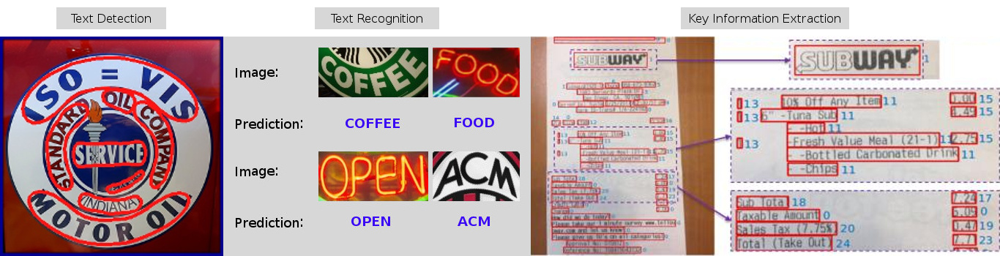

<div align="center">
  
</div>

## 简介

[English](/README.md) | 简体中文

[](https://github.com/open-mmlab/mmocr/actions)
[](https://mmocr.readthedocs.io/en/latest/?badge=latest)
[](https://codecov.io/gh/open-mmlab/mmocr)
[](https://github.com/open-mmlab/mmocr/blob/main/LICENSE)
[](https://pypi.org/project/mmocr/)
[](https://github.com/open-mmlab/mmocr/issues)
[](https://github.com/open-mmlab/mmocr/issues)

MMOCR 是基于 PyTorch 和 mmdetection 的开源工具箱，专注于文本检测，文本识别以及相应的下游任务，如关键信息提取。 它是 OpenMMLab 项目的一部分。

主分支目前支持 **PyTorch 1.5 以上**的版本。

文档：https://mmocr.readthedocs.io/en/latest/。

<div align="left">
  
</div>

### 主要特性

-**全流程**

   该工具箱不仅支持文本检测和文本识别，还支持其下游任务，例如关键信息提取。

-**多种模型**

  该工具箱支持用于文本检测，文本识别和关键信息提取的各种最新模型。

-**模块化设计**

  MMOCR 的模块化设计使用户可以定义自己的优化器，数据预处理器，模型组件如主干模块，颈部模块和头部模块，以及损失函数。有关如何构建自定义模型的信
息，请参考[快速入门](docs/getting_started.md)。

-**众多实用工具**

  该工具箱提供了一套全面的实用程序，可以帮助用户评估模型的性能。它包括可对图像，标注的真值以及预测结果进行可视化的可视化工具，以及用于在训练过程中评估模型的验证工具。它还包括数据转换器，演示了如何将用户自建的标注数据转换为 MMOCR 支持的标注文件。
## [模型库](https://mmocr.readthedocs.io/en/latest/modelzoo.html)

支持的算法：

<details open>
<summary>文字检测</summary>

- [x] [DBNet](configs/textdet/dbnet/README.md) (AAAI'2020)
- [x] [Mask R-CNN](configs/textdet/maskrcnn/README.md) (ICCV'2017)
- [x] [PANet](configs/textdet/panet/README.md) (ICCV'2019)
- [x] [PSENet](configs/textdet/psenet/README.md) (CVPR'2019)
- [x] [TextSnake](configs/textdet/textsnake/README.md) (ECCV'2018)
- [x] [DRRG](configs/textdet/drrg/README.md) (CVPR'2020)
- [x] [FCENet](configs/textdet/fcenet/README.MD) (CVPR'2021)

</details>

<details open>
<summary>文字识别</summary>

- [x] [CRNN](configs/textrecog/crnn/crnn_academic_dataset.py) (TPAMI'2016)
- [x] [NRTR](configs/textrecog/nrtr/README.md) (ICDAR'2019)
- [x] [RobustScanner](configs/textrecog/robust_scanner/README.md) (ECCV'2020)
- [x] [SAR](configs/textrecog/sar/README.md) (AAAI'2019)
- [x] [SegOCR](configs/bottom_up/higherhrnet/README.md) (Manuscript'2021)

</details>

<details open>
<summary>关键信息提取</summary>

- [x] [SDMG-R](configs/kie/sdmgr/README.md) (ArXiv'2021)

</details>

<details open>
<summary>命名实体识别</summary>

- [x] [Bert-Softmax](configs/ner/bert_softmax/README.md) (NAACL'2019)

</details>

请点击[模型库](https://mmocr.readthedocs.io/en/latest/modelzoo.html)查看更多关于上述算法的详细信息。

## 开源许可证

该项目采用 [Apache 2.0 license](LICENSE) 开源许可证。

## 引用

如果您发现此项目对您的研究有用，请考虑引用：

```bibtex
@misc{mmocr2021,
    title={MMOCR:  A Comprehensive Toolbox for Text Detection, Recognition and Understanding},
    author={MMOCR Contributors},
    howpublished = {\url{https://github.com/open-mmlab/mmocr}},
    year={2021}
}
```

## 更新日志

最新的月度版本 v0.2.0 在 2021.05.18 发布。


## 安装

请参考[安装文档](docs/install.md)进行安装。

## 快速入门

请参考[快速入门](docs/getting_started.md)文档学习 MMOCR 的基本使用。

## 贡献指南

我们感谢所有的贡献者为改进和提升 MMOCR 所作出的努力。请参考[贡献指南](.github/CONTRIBUTING.md)来了解参与项目贡献的相关指引。

## 致谢
MMOCR 是一款由来自不同高校和企业的研发人员共同参与贡献的开源项目。我们感谢所有为项目提供算法复现和新功能支持的贡献者，以及提供宝贵反馈的用户。 我们希望此工具箱可以帮助大家来复现已有的方法和开发新的方法，从而为研究社区贡献力量。

## OpenMMLab 的其他项目


- [MMCV](https://github.com/open-mmlab/mmcv): OpenMMLab 计算机视觉基础库
- [MMClassification](https://github.com/open-mmlab/mmclassification): OpenMMLab 图像分类工具箱与测试基准
- [MMDetection](https://github.com/open-mmlab/mmdetection): OpenMMLab 检测工具箱与测试基准
- [MMDetection3D](https://github.com/open-mmlab/mmdetection3d): OpenMMLab 新一代通用3D目标检测平台
- [MMSegmentation](https://github.com/open-mmlab/mmsegmentation): OpenMMLab 语义分割工具箱与测试基准
- [MMAction2](https://github.com/open-mmlab/mmaction2): OpenMMLab 新一代视频理解工具箱与测试基准
- [MMTracking](https://github.com/open-mmlab/mmtracking): OpenMMLab 一体化视频目标感知平台
- [MMPose](https://github.com/open-mmlab/mmpose): OpenMMLab 姿态估计工具箱与测试基准
- [MMEditing](https://github.com/open-mmlab/mmediting): OpenMMLab 图像视频编辑工具箱
- [MMOCR](https://github.com/open-mmlab/mmocr): OpenMMLab 全流程文字检测识别理解工具包.
- [MMGeneration](https://github.com/open-mmlab/mmgeneration): OpenMMLab 图片视频生成模型工具箱

## 欢迎加入 OpenMMLab 社区

扫描下方的二维码可关注 OpenMMLab 团队的 [知乎官方账号](https://www.zhihu.com/people/openmmlab)，加入 OpenMMLab 团队的 [官方交流 QQ 群](https://jq.qq.com/?_wv=1027&k=aCvMxdr3)

<div align="center">
  
</div>

我们会在 OpenMMLab 社区为大家

- 📢 分享 AI 框架的前沿核心技术
- 💻 解读 PyTorch 常用模块源码
- 📰 发布 OpenMMLab 的相关新闻
- 🚀 介绍 OpenMMLab 开发的前沿算法
- 🏃 获取更高效的问题答疑和意见反馈
- 🔥 提供与各行各业开发者充分交流的平台

干货满满 📘，等你来撩 💗，OpenMMLab 社区期待您的加入 👬
