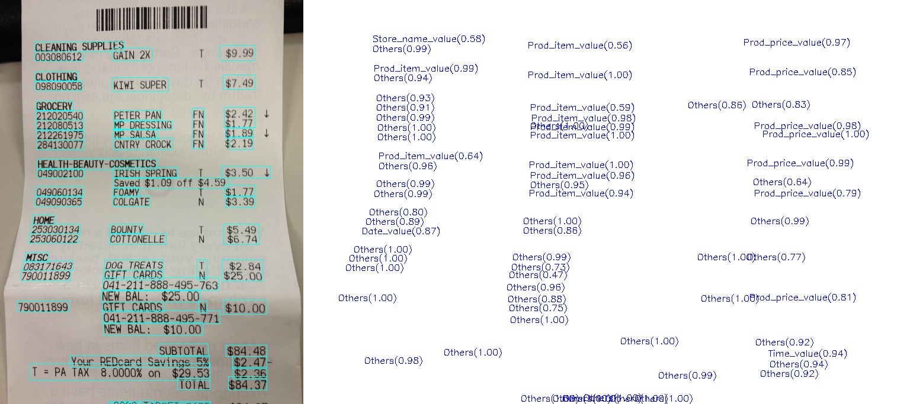

## KIE End2End Demo

<div align="center">
    <br>
</div>

### End-to-End KIE Demo

End-toEnd KIE performs text detection and recognition before key information extraction (KIE). To end-to-end test a single image for KIE:

```shell
python demo/kie_image_demo.py demo/demo_kie.jpg demo/output.jpg
```

- The default config for text detection, recognition and kie are [PSENet_ICDAR2015](/configs/textdet/psenet/psenet_r50_fpnf_600e_icdar2015.py), [SAR](/configs/textrecog/sar/sar_r31_parallel_decoder_academic.py) and [SDMG-R](/configs/kie/sdmgr/sdmgr_unet16_60e_wildreceipt.py) respectively.

- The predicted image and result will be saved as `demo/output.jpg` and `demo/output.jpg.json` respectively.
- To use other algorithms of text detection, recognition and kie, please set arguments: `--det-config`, `--det-ckpt`, `--recog-config`, `--recog-ckpt`, `--kie-config`, `--kie-ckpt`.
- To use batch mode for text recognition, please set arguments: `--batch-mode`, `--batch-size`.

### Remarks

1. If `--imshow` is specified, the demo will also show the image with OpenCV.
2. The `kie_image_demo.py` script only supports GPU and so the `--device` parameter cannot take cpu as an argument.
