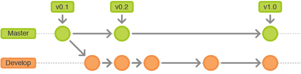
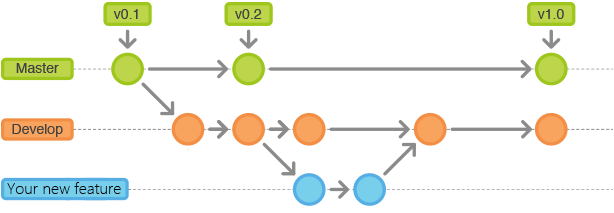

<a id="markdown-contributing-to-mmocr" name="contributing-to-mmocr"></a>
# Contributing to mmocr

All kinds of contributions are welcome, including but not limited to the following.

- Fixes (typo, bugs)
- New features and components
- Enhancement like function speedup
<!-- TOC -->

- [Contributing to mmocr](#contributing-to-mmocr)
  - [Workflow](#workflow)
    - [Step 1: creating a Fork](#step-1-creating-a-fork)
    - [Step 2: develop a new feature](#step-2-develop-a-new-feature)
      - [Step 2.1: keeping your fork up to date](#step-21-keeping-your-fork-up-to-date)
      - [<span id = "step2.2">Step 2.2: creating a feature branch</span>](#step-22-creating-a-feature-branch)
        - [Creating an issue on github](#creating-an-issue-on-github)
        - [Create branch](#create-branch)
      - [Step 2.3: develop and test <your_new_feature>](#step-23-develop-and-test-your_new_feature)
      - [Step 2.4: prepare to PR](#step-24-prepare-to-pr)
        - [Merge official repo updates to your fork](#merge-official-repo-updates-to-your-fork)
        - [Push <your_new_feature> branch to your remote forked repo,](#push-your_new_feature-branch-to-your-remote-forked-repo)
      - [Step 2.5: send PR](#step-25-send-pr)
      - [Step 2.6: review code](#step-26-review-code)
      - [Step 2.7: revise <your_new_feature>  (optional)](#step-27-revise-your_new_feature--optional)
      - [Step 2.8: del <your_new_feature> branch if your PR is accepted.](#step-28-del-your_new_feature-branch-if-your-pr-is-accepted)
  - [Code style](#code-style)
    - [Python](#python)
    - [C++ and CUDA](#c-and-cuda)

<!-- /TOC -->
<a id="markdown-workflow" name="workflow"></a>
## Workflow

This document describes the fork & merge request workflow that should be used when contributing to **MMOCR**.

The official public [repository](https://github.com/open-mmlab/mmocr) holds two branches with an infinite lifetime only:
+ master
+ develop

The *master* branch is the main branch where the source code of **HEAD** always reflects a *production-ready state*.

The *develop* branch is the branch where the source code of **HEAD** always reflects a state with the latest development changes for the next release.

Feature branches are used to develop new features for the upcoming or a distant future release.



All new developers to **MMOCR** need to follow the following steps:

<a id="markdown-step-1-creating-a-fork" name="step-1-creating-a-fork"></a>
### Step 1: creating a Fork

1. Fork the repo on GitHub or GitLab to your personal account. Click the `Fork` button on the [project page](https://github.com/open-mmlab/mmocr).

2. Clone your new forked repo to your computer.
```
git clone https://github.com/<your name>/mmocr.git
```
3. Add the official repo as an upstream:
```
git remote add upstream https://github.com/open-mmlab/mmocr.git
```

<a id="markdown-step-2-develop-a-new-feature" name="step-2-develop-a-new-feature"></a>
### Step 2: develop a new feature

<a id="markdown-step-21-keeping-your-fork-up-to-date" name="step-21-keeping-your-fork-up-to-date"></a>
#### Step 2.1: keeping your fork up to date

Whenever you want to update your fork with the latest upstream changes, you need to fetch the upstream repo's branches and latest commits to bring them into your repository:

```
# Fetch from upstream remote
git fetch upstream

# Update your master branch
git checkout master
git rebase upstream/master
git push origin master

# Update your develop branch
git checkout develop
git rebase upsteam/develop
git push origin develop
```

<a id="markdown-span-id--step22step-22-creating-a-feature-branchspan" name="span-id--step22step-22-creating-a-feature-branchspan"></a>
#### <span id = "step2.2">Step 2.2: creating a feature branch</span>
<a id="markdown-creating-an-issue-on-githubhttpsgithubcomopen-mmlabmmocr" name="creating-an-issue-on-githubhttpsgithubcomopen-mmlabmmocr"></a>
##### Creating an issue on [github](https://github.com/open-mmlab/mmocr)
- The title of the issue should be one of the following formats: `[Feature]: xxx`, `[Fix]: xxx`, `[Enhance]: xxx`, `[Refactor]: xxx`.
- More details can be written in comments.

<a id="markdown-create-branch" name="create-branch"></a>
##### Create branch
```
git checkout -b feature/iss_<index> develop
# index is the issue number above
```
Till now, your fork has three branches as follows:



<a id="markdown-step-23-develop-and-test-your_new_feature" name="step-23-develop-and-test-your_new_feature"></a>
#### Step 2.3: develop and test <your_new_feature>

Develop your new feature and test it to make sure it works well.

Pls run
```
pre-commit run --all-files
pytest tests
```
and fix all failures before every git commit.
```
git commit -m "fix #<issue_index>: <commit_message>"
```
**Note:**
- <issue_index> is the [issue](#step2.2) number.

<a id="markdown-step-24-prepare-to-pr" name="step-24-prepare-to-pr"></a>
#### Step 2.4: prepare to PR
- Make sure to link your pull request to the related issue. Please refer to the [instructon](https://docs.github.com/en/github/managing-your-work-on-github/linking-a-pull-request-to-an-issue)


<a id="markdown-merge-official-repo-updates-to-your-fork" name="merge-official-repo-updates-to-your-fork"></a>
##### Merge official repo updates to your fork

```
# fetch from upstream remote. i.e., the official repo
git fetch upstream

# update the develop branch of your fork
git checkout develop
git rebase upsteam/develop
git push origin develop

# update the <your_new_feature> branch
git checkout <your_new_feature>
git rebase develop
# solve conflicts if any and Test
```

<a id="markdown-push-your_new_feature-branch-to-your-remote-forked-repo" name="push-your_new_feature-branch-to-your-remote-forked-repo"></a>
##### Push <your_new_feature> branch to your remote forked repo,
```
git checkout <your_new_feature>
git push origin <your_new_feature>
```
<a id="markdown-step-25-send-pr" name="step-25-send-pr"></a>
#### Step 2.5: send PR

Go to the page for your fork on GitHub, select your new feature branch, and click the pull request button to integrate your feature branch into the upstream remote’s develop branch.

<a id="markdown-step-26-review-code" name="step-26-review-code"></a>
#### Step 2.6: review code


<a id="markdown-step-27-revise-your_new_feature--optional" name="step-27-revise-your_new_feature--optional"></a>
#### Step 2.7: revise <your_new_feature>  (optional)
If PR is not accepted, pls follow Step 2.1, 2.3, 2.4 and 2.5 till your PR is accepted.

<a id="markdown-step-28-del-your_new_feature-branch-if-your-pr-is-accepted" name="step-28-del-your_new_feature-branch-if-your-pr-is-accepted"></a>
#### Step 2.8: del <your_new_feature> branch if your PR is accepted.
```
git branch -d <your_new_feature>
git push origin :<your_new_feature>
```

<a id="markdown-code-style" name="code-style"></a>
## Code style

<a id="markdown-python" name="python"></a>
### Python
We adopt [PEP8](https://www.python.org/dev/peps/pep-0008/) as the preferred code style.

We use the following tools for linting and formatting:
- [flake8](http://flake8.pycqa.org/en/latest/): linter
- [yapf](https://github.com/google/yapf): formatter
- [isort](https://github.com/timothycrosley/isort): sort imports

>Before you create a PR, make sure that your code lints and is formatted by yapf.

<a id="markdown-c-and-cuda" name="c-and-cuda"></a>
### C++ and CUDA
We follow the [Google C++ Style Guide](https://google.github.io/styleguide/cppguide.html).
