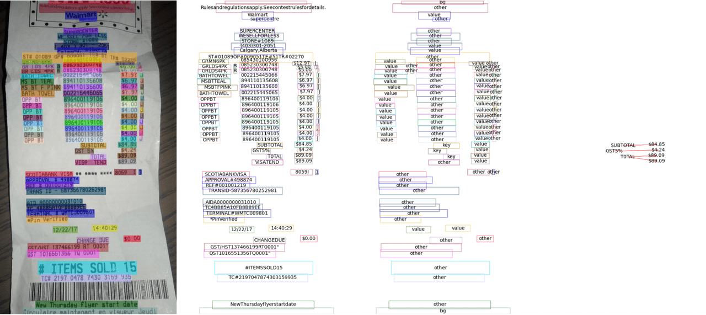

# 训练与测试

为了适配多样化的用户需求，MMOCR 实现了多种不同操作系统及设备上的模型训练及测试。无论是使用本地机器进行单机单卡训练测试，还是在部署了 slurm 系统的大规模集群上进行训练测试，MMOCR 都提供了便捷的解决方案。

## 单卡机器训练及测试

### 训练

`tools/train.py` 实现了基础的训练服务。MMOCR 推荐用户使用 GPU 进行模型训练和测试，但是，用户也可以通过指定 `CUDA_VISIBLE_DEVICES=-1` 来使用 CPU 设备进行模型训练及测试。例如，以下命令演示了如何使用 CPU 或单卡 GPU 来训练 DBNet 文本检测器。

```bash
# 通过调用 tools/train.py 来训练指定的 MMOCR 模型
CUDA_VISIBLE_DEVICES= python tools/train.py ${CONFIG_FILE} [PY_ARGS]

# 训练
# 示例 1：使用 CPU 训练 DBNet
CUDA_VISIBLE_DEVICES=-1 python tools/train.py configs/textdet/dbnet/dbnet_resnet50-dcnv2_fpnc_1200e_icdar2015.py
# 示例 2：指定使用 gpu:0 训练 DBNet，指定工作目录为 dbnet/，并打开混合精度（amp）训练
CUDA_VISIBLE_DEVICES=0 python tools/train.py configs/textdet/dbnet/dbnet_resnet50-dcnv2_fpnc_1200e_icdar2015.py --work-dir dbnet/ --amp
```

```{note}
此外，如需使用指定编号的 GPU 进行训练或测试，例如使用3号 GPU，则可以通过设定 CUDA_VISIBLE_DEVICES=3 来实现。
```

下表列出了 `train.py` 支持的所有参数。其中，不带 `--` 前缀的参数为必须的位置参数，带 `--` 前缀的参数为可选参数。

| 参数            | 类型 | 说明                                                           |
| --------------- | ---- | -------------------------------------------------------------- |
| config          | str  | （必须）配置文件路径。                                         |
| --work-dir      | str  | 指定工作目录，用于存放训练日志以及模型 checkpoints。           |
| --resume        | bool | 是否从断点处恢复训练。                                         |
| --amp           | bool | 是否使用混合精度。                                             |
| --auto-scale-lr | bool | 是否使用学习率自动缩放。                                       |
| --cfg-options   | str  | 用于覆写配置文件中的指定参数。[示例](#添加示例)                |
| --launcher      | str  | 启动器选项，可选项目为 \['none', 'pytorch', 'slurm', 'mpi'\]。 |
| --local_rank    | int  | 本地机器编号，用于多机多卡分布式训练，默认为 0。               |

### 测试

`tools/test.py` 提供了基础的测试服务，其使用原理和训练脚本类似。例如，以下命令演示了 CPU 或 GPU 单卡测试 DBNet 模型。

```bash
# 通过调用 tools/test.py 来测试指定的 MMOCR 模型
CUDA_VISIBLE_DEVICES= python tools/test.py ${CONFIG_FILE} ${CHECKPOINT_FILE} [PY_ARGS]

# 测试
# 示例 1：使用 CPU 测试 DBNet
CUDA_VISIBLE_DEVICES=-1 python tools/test.py configs/textdet/dbnet/dbnet_resnet50-dcnv2_fpnc_1200e_icdar2015.py dbnet_r50.pth
# 示例 2：使用 gpu:0 测试 DBNet
CUDA_VISIBLE_DEVICES=0 python tools/test.py configs/textdet/dbnet/dbnet_resnet50-dcnv2_fpnc_1200e_icdar2015.py dbnet_r50.pth
```

下表列出了 `test.py` 支持的所有参数。其中，不带 `--` 前缀的参数为必须的位置参数，带 `--` 前缀的参数为可选参数。

| 参数          | 类型  | 说明                                                           |
| ------------- | ----- | -------------------------------------------------------------- |
| config        | str   | （必须）配置文件路径。                                         |
| checkpoint    | str   | （必须）待测试模型路径。                                       |
| --work-dir    | str   | 工作目录，用于存放训练日志以及模型 checkpoints。               |
| --save-preds  | bool  | 是否将预测结果写入 pkl 文件并保存。                            |
| --show        | bool  | 是否可视化预测结果。                                           |
| --show-dir    | str   | 将可视化的预测结果保存至指定路径。                             |
| --wait-time   | float | 可视化间隔时间（秒），默认为 2 秒。                            |
| --cfg-options | str   | 用于覆写配置文件中的指定参数。[示例](#添加示例)                |
| --launcher    | str   | 启动器选项，可选项目为 \['none', 'pytorch', 'slurm', 'mpi'\]。 |
| --local_rank  | int   | 本地机器编号，用于多机多卡分布式训练，默认为 0。               |

## 多卡机器训练及测试

对于大规模模型，采用多 GPU 训练和测试可以极大地提升操作的效率。为此，MMOCR 提供了基于 \[MMDistributedDataParallel\](#todo 添加链接至 mmengine) 实现的分布式脚本 `tools/dist_train.sh` 和 `tools/dist_test.sh`。

```bash
# 训练
NNODES=${NNODES} NODE_RANK=${NODE_RANK} PORT=${MASTER_PORT} MASTER_ADDR=${MASTER_ADDR} ./tools/dist_train.sh ${CONFIG_FILE} ${GPU_NUM} [PY_ARGS]
# 测试
NNODES=${NNODES} NODE_RANK=${NODE_RANK} PORT=${MASTER_PORT} MASTER_ADDR=${MASTER_ADDR} ./tools/dist_test.sh ${CONFIG_FILE} ${CHECKPOINT_FILE} ${GPU_NUM} [PY_ARGS]
```

下表列出了 `dist_*.sh` 支持的参数：

| 参数            | 类型 | 说明                                                                               |
| --------------- | ---- | ---------------------------------------------------------------------------------- |
| NNODES          | int  | 总共使用的机器节点个数，默认为 1。                                                 |
| NODE_RANK       | int  | 节点编号，默认为 0。                                                               |
| PORT            | int  | 在 RANK 0 机器上使用的 MASTER_PORT 端口号，取值范围是 0 至 65536，默认值为 29500。 |
| MASTER_ADDR     | str  | RANK 0 机器的 IP 地址，默认值为 127.0.0.1。                                        |
| CONFIG_FILE     | str  | （必须）指定配置文件的地址。                                                       |
| CHECKPOINT_FILE | str  | （必须，仅在 dist_test.sh 中适用）指定模型权重的地址。                             |
| GPU_NUM         | int  | （必须）指定 GPU 的数量。                                                          |
| \[PY_ARGS\]     | str  | 该部分一切的参数都会被直接传入 tools/train.py 或 tools/test.py 中。                |

这两个脚本可以实现**单机多卡**或**多机多卡**的训练和测试，下面演示了它们在不同场景下的用法。

### 单机多卡

以下命令演示了如何在搭载多块 GPU 的**单台机器**上使用指定数目的 GPU 进行训练及测试：

1. **训练**

   使用单台机器上的 4 块 GPU 训练 DBNet。

   ```bash
   # 单机 4 卡训练 DBNet
   tools/dist_train.sh configs/textdet/dbnet/dbnet_r50dcnv2_fpnc_1200e_icdar2015.py 4
   ```

2. **测试**

   使用单台机器上的 4 块 GPU 测试 DBNet。

   ```bash
   # 单机 4 卡测试 DBNet
   tools/dist_test.sh configs/textdet/dbnet/dbnet_r50dcnv2_fpnc_1200e_icdar2015.py dbnet_r50.pth 4
   ```

### 单机多任务训练及测试

对于搭载多块 GPU 的单台服务器而言，用户可以通过指定 GPU 的形式来同时执行不同的训练任务。例如，以下命令演示了如何在一台 8 卡 GPU 服务器上分别使用 `[0, 1, 2, 3]` 卡测试 DBNet 及 `[4, 5, 6, 7]` 卡训练 CRNN：

```bash
# 指定使用 gpu:0,1,2,3 测试 DBNet，并分配端口号 29500
CUDA_VISIBLE_DEVICES=0,1,2,3 PORT=29500 ./tools/dist_test.sh configs/textdet/dbnet/dbnet_r50dcnv2_fpnc_1200e_icdar2015.py dbnet_r50.pth 4
# 指定使用 gpu:4,5,6,7 训练 CRNN，并分配端口号 29501
CUDA_VISIBLE_DEVICES=4,5,6,7 PORT=29501 ./tools/dist_train.sh configs/textrecog/crnn/crnn_academic_dataset.py 4
```

```{note}
`dist_train.sh` 默认将 `MASTER_PORT` 设置为 `29500`，当单台机器上有其它进程已占用该端口时，程序则会出现运行时错误 `RuntimeError: Address already in use`。此时，用户需要将 `MASTER_PORT` 设置为 `(0~65535)` 范围内的其它空闲端口号。
```

### 多机多卡训练及测试

MMOCR 基于[torch.distributed](https://pytorch.org/docs/stable/distributed.html#launch-utility) 提供了相同局域网下的多台机器间的多卡分布式训练。

1. **训练**

   以下命令演示了如何在两台机器上分别使用 2 张 GPU 合计 4 卡训练 DBNet：

```bash
# 示例：在两台机器上分别使用 2 张 GPU 合计 4 卡训练 DBNet
# 在 “机器1” 上运行以下命令
NNODES=2 NODE_RANK=0 PORT=29501 MASTER_ADDR=10.140.0.169 tools/dist_train.sh configs/textdet/dbnet/dbnet_r50dcnv2_fpnc_1200e_icdar2015.py 2
# 在 “机器2” 上运行以下命令
NNODES=2 NODE_RANK=1 PORT=29501 MASTER_ADDR=10.140.0.169 tools/dist_train.sh configs/textdet/dbnet/dbnet_r50dcnv2_fpnc_1200e_icdar2015.py 2
```

2. **测试**

   以下命令演示了如何在两台机器上分别使用 2 张 GPU 合计 4 卡测试：

```bash
# 示例：在两台机器上分别使用 2 张 GPU 合计 4 卡测试
# 在 “机器1” 上运行以下命令
NNODES=2 NODE_RANK=0 PORT=29500 MASTER_ADDR=10.140.0.169 tools/dist_test.sh configs/textdet/dbnet/dbnet_r50dcnv2_fpnc_1200e_icdar2015.py dbnet_r50.pth 2
# 在 “机器2” 上运行以下命令
NNODES=2 NODE_RANK=1 PORT=29501 MASTER_ADDR=10.140.0.169 tools/dist_test.sh configs/textdet/dbnet/dbnet_r50dcnv2_fpnc_1200e_icdar2015.py dbnet_r50.pth 2
```

```{note}
需要注意的是，采用多机多卡训练时，机器间的网络传输速度可能成为训练速度的瓶颈。
```

## 集群训练及测试

针对 slurm 调度系统管理的计算集群，MMOCR 提供了对应的训练和测试任务提交脚本 `tools/slurm_train.sh` 及 `tools/slurm_test.sh`。

```bash
# tools/slurm_train.sh 提供基于 slurm 调度系统管理的计算集群上提交训练任务的脚本
GPUS=${GPUS} GPUS_PER_NODE=${GPUS_PER_NODE} CPUS_PER_TASK=${CPUS_PER_TASK} SRUN_ARGS=${SRUN_ARGS} ./tools/slurm_train.sh ${PARTITION} ${JOB_NAME} ${CONFIG_FILE} ${WORK_DIR} [PY_ARGS]

# tools/slurm_test.sh 提供基于 slurm 调度系统管理的计算集群上提交测试任务的脚本
GPUS=${GPUS} GPUS_PER_NODE=${GPUS_PER_NODE} CPUS_PER_TASK=${CPUS_PER_TASK} SRUN_ARGS=${SRUN_ARGS} ./tools/slurm_test.sh ${PARTITION} ${JOB_NAME} ${CONFIG_FILE} ${CHECKPOINT_FILE} ${WORK_DIR} [PY_ARGS]
```

| 参数            | 类型 | 说明                                                                      |
| --------------- | ---- | ------------------------------------------------------------------------- |
| GPUS            | int  | 使用的 GPU 数目，默认为8。                                                |
| GPUS_PER_NODE   | int  | 每台节点机器上搭载的 GPU 数目，默认为8。                                  |
| CPUS_PER_TASK   | int  | 任务使用的 CPU 个数，默认为5。                                            |
| SRUN_ARGS       | str  | 其他 srun 支持的参数。                                                    |
| PARTITION       | str  | （必须）指定使用的集群分区。                                              |
| JOB_NAME        | str  | （必须）提交任务的名称。                                                  |
| WORK_DIR        | str  | （必须）任务的工作目录，训练日志以及模型的 checkpoints 将被保存至该目录。 |
| CHECKPOINT_FILE | str  | （必须，仅在 slurm_test.sh 中适用）指向模型权重的地址。                   |
| PY_ARGS         | str  | tools/train.py 以及 tools/test.py 支持的参数。                            |

这两个脚本可以实现 slurm 集群上的训练和测试，下面演示了它们在不同场景下的用法。

1. 训练
   以下示例为在 slurm 集群 dev 分区申请 1 块 GPU 进行 DBNet 训练。

```bash
# 示例：在 slurm 集群 dev 分区申请 1块 GPU 资源进行 DBNet 训练任务
GPUS=1 GPUS_PER_NODE=1 CPUS_PER_TASK=5 tools/slurm_train.sh dev db_r50 configs/textdet/dbnet/dbnet_r50dcnv2_fpnc_1200e_icdar2015.py work_dir
```

2. 测试
   同理， 则提供了测试任务提交脚本。以下示例为在 slurm 集群 dev 分区申请 1 块 GPU 资源进行 DBNet 测试。

```bash
# 示例：在 slurm 集群 dev 分区申请 1块 GPU 资源进行 DBNet 测试任务
GPUS=1 GPUS_PER_NODE=1 CPUS_PER_TASK=5 tools/slurm_train.sh dev db_r50 configs/textdet/dbnet/dbnet_r50dcnv2_fpnc_1200e_icdar2015.py dbnet_r50.pth work_dir
```

## 进阶技巧

### 从断点恢复训练

`tools/train.py` 提供了从断点恢复训练的功能，用户仅需在命令中指定 `--resume` 参数，即可自动从断点恢复训练。

```bash
# 示例：从断点恢复训练
python tools/train.py configs/textdet/dbnet/dbnet_r50dcnv2_fpnc_1200e_icdar2015.py 4 --resume
```

默认地，程序将自动从上次训练过程中最后成功保存的断点，即 latest.pth 处开始继续训练。如果用户希望指定从特定的断点处开始恢复训练，则可以按如下格式在模型的配置文件中设定该断点的路径。

```python
# 示例：在配置文件中设置想要加载的断点路径
load_from = 'work_dir/dbnet/models/epoch_10000.pth'
```

### 混合精度训练

混合精度训练可以在缩减内存占用的同时提升训练速度，为此，MMOCR 提供了一键式的混合精度训练方案，仅需在训练时添加 `--amp` 参数即可。

```bash
# 示例：使用自动混合精度训练
python tools/train.py configs/textdet/dbnet/dbnet_r50dcnv2_fpnc_1200e_icdar2015.py 4 --amp
```

下表列出了 MMOCR 中各算法对自动混合精度训练的支持情况：

|               | 是否支持混合精度训练 |             备注              |
| ------------- | :------------------: | :---------------------------: |
|               |       文本检测       |                               |
| DBNet         |          是          |                               |
| DBNetpp       |          是          |                               |
| DRRG          |          否          | roi_align_rotated 不支持 fp16 |
| FCENet        |          否          |      BCELoss 不支持 fp16      |
| Mask R-CNN    |          是          |                               |
| PANet         |          是          |                               |
| PSENet        |          是          |                               |
| TextSnake     |          否          |                               |
|               |       文本识别       |                               |
| ABINet        |          是          |                               |
| CRNN          |          是          |                               |
| MASTER        |          是          |                               |
| NRTR          |          是          |                               |
| RobustScanner |          是          |                               |
| SAR           |          是          |                               |
| SATRN         |          是          |                               |

### 自动学习率缩放

MMOCR 在配置文件中为每一个模型设置了默认的初始学习率，然而，当用户使用不同于我们预设的 `base_batch_size` 时，这些初始学习率可能不再完全适用。因此，我们提供了自动学习率缩放工具。当使用不同于 MMOCR 预设的 `base_batch_size` 进行训练时，用户仅需添加 `--auto-scale-lr` 参数即可自动依据新的 `batch_size` 将学习率缩放至对应尺度。

```bash
# 示例：使用自动学习率缩放
python tools/train.py configs/textdet/dbnet/dbnet_r50dcnv2_fpnc_1200e_icdar2015.py 4 --auto-scale-lr
```

### 可视化模型测试结果

`tools/test.py` 提供了可视化接口，以方便用户对模型进行定性分析。


(绿色框为真实标注，红色框为预测结果)


（绿色字体为真实标注，红色字体为预测结果）



（从左至右分别为：原图，文本检测和识别结果，文本分类结果，关系图）

```bash
# 示例1：每间隔 2 秒绘制出
python tools/test.py configs/textdet/dbnet/dbnet_r50dcnv2_fpnc_1200e_icdar2015.py dbnet_r50.pth --show --wait-time 2

# 示例2：对于不支持图形化界面的系统（如计算集群等），可以将可视化结果存入指定路径
python tools/test.py configs/textdet/dbnet/dbnet_r50dcnv2_fpnc_1200e_icdar2015.py dbnet_r50.pth --show-dir ./vis_results
```

`tools/test.py` 中可视化相关参数说明：

| 参数        | 类型  | 说明                   |
| ----------- | ----- | ---------------------- |
| --show      | bool  | 是否绘制可视化结果。   |
| --show-dir  | str   | 可视化图片存储路径。   |
| --wait-time | float | 可视化间隔时间（秒）。 |
